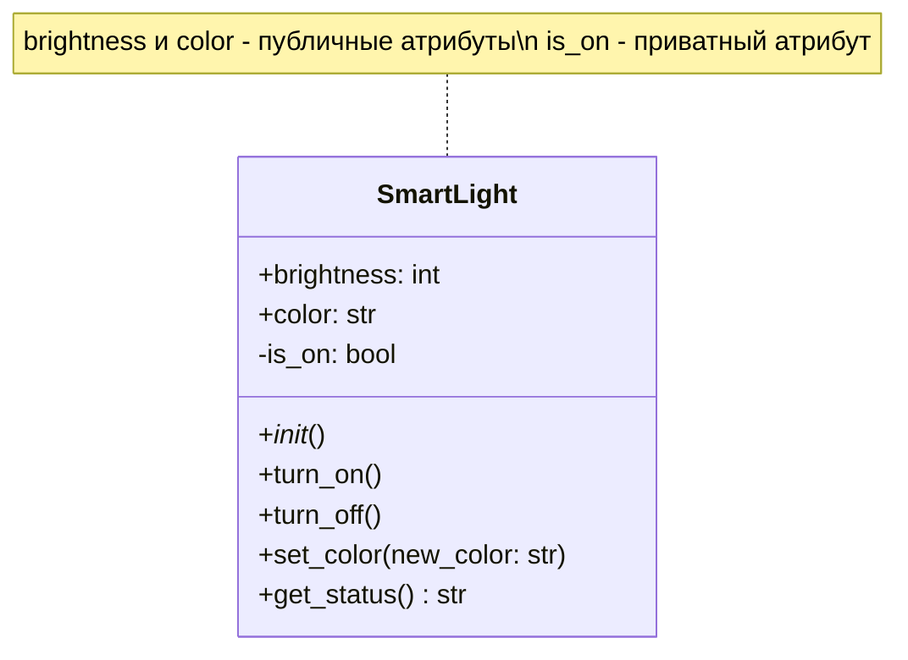

## Задание 1

```mermaid
classDiagram
    class SmartLight {
        +brightness: int
        +color: str
        -is_on: bool
        +_init_()
        +turn_on()
        +turn_off()
        +set_color(new_color: str)
        +get_status() str}
    note for SmartLight "brightness и color - публичные атрибуты\n is_on - приватный атрибут"
```