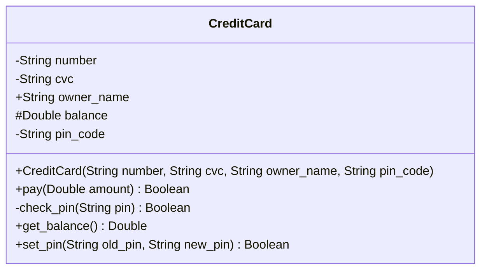

## Задание 2

```mermaid
classDiagram
    class CreditCard {
        -String number
        -String cvc
        +String owner_name
        #Double balance
        -String pin_code
        
        +CreditCard(String number, String cvc, String owner_name, String pin_code)
        +pay(Double amount) Boolean
        -check_pin(String pin) Boolean
        +get_balance() Double
        +set_pin(String old_pin, String new_pin) Boolean}
```