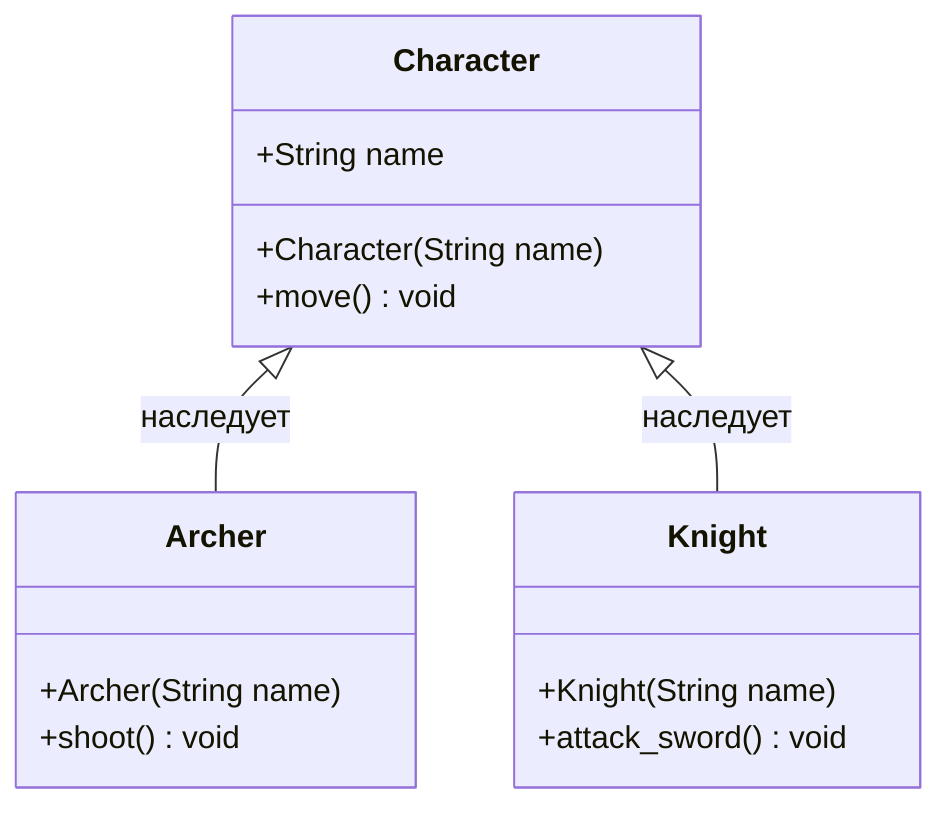

## Задание 3

```mermaid
classDiagram
    class Character {
        +String name
        +Character(String name)
        +move() void}
    class Archer {
        +Archer(String name)
        +shoot() void}
    class Knight {
        +Knight(String name)
        +attack_sword() void}
    Character <|-- Archer : наследует
    Character <|-- Knight : наследует
```