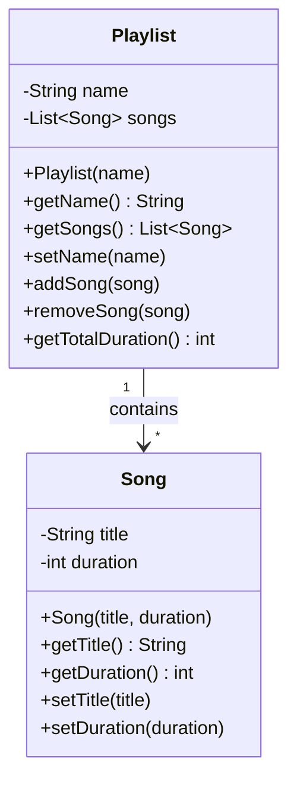

## Задание 4

```mermaid 
classDiagram
    class Song {
        -String title
        -int duration
        +Song(title, duration)
        +getTitle() String
        +getDuration() int
        +setTitle(title)
        +setDuration(duration)}
    class Playlist {
        -String name
        -List~Song~ songs
        +Playlist(name)
        +getName() String
        +getSongs() List~Song~
        +setName(name)
        +addSong(song)
        +removeSong(song)
        +getTotalDuration() int}
   Playlist "1" --> "*" Song : contains
```