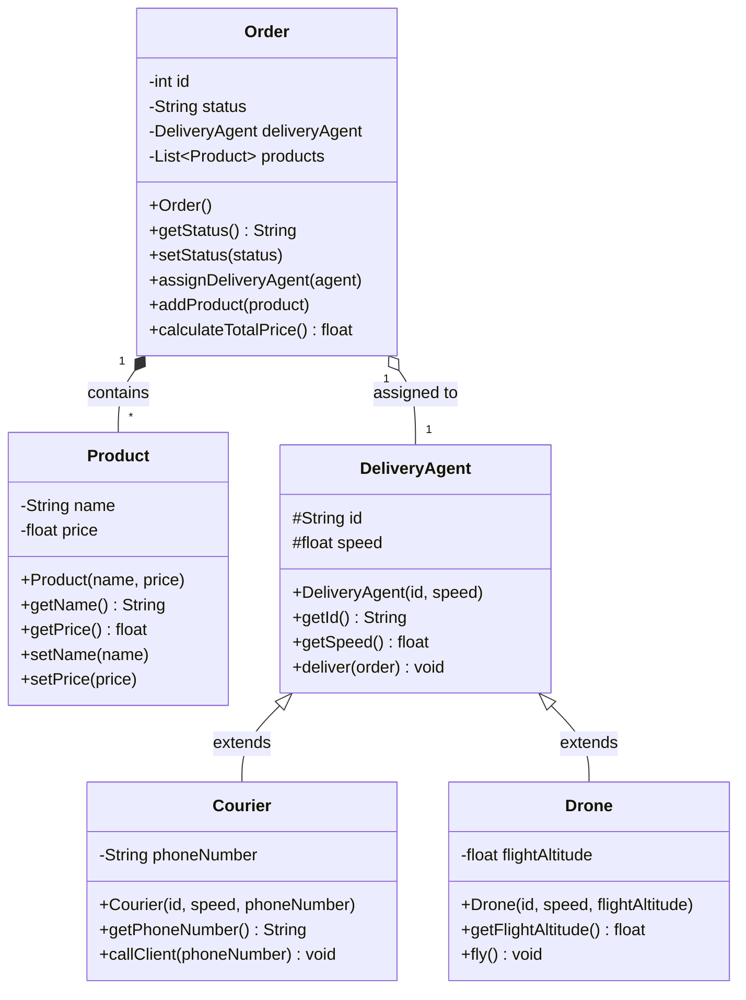

## Задание 5

```mermaid
classDiagram
    class Order {
        -int id
        -String status
        -DeliveryAgent deliveryAgent
        -List~Product~ products
        +Order()
        +getStatus() String
        +setStatus(status)
     +assignDeliveryAgent(agent)
        +addProduct(product)
        +calculateTotalPrice() float}
    class Product {
        -String name
        -float price
        +Product(name, price)
        +getName() String
        +getPrice() float
        +setName(name)
        +setPrice(price)}
    class DeliveryAgent {
        #String id
        #float speed
        +DeliveryAgent(id, speed)
        +getId() String
        +getSpeed() float
        +deliver(order) void}
    class Courier {
        -String phoneNumber
        +Courier(id, speed, phoneNumber)
        +getPhoneNumber() String
       +callClient(phoneNumber) void}
    class Drone {
        -float flightAltitude
        +Drone(id, speed, flightAltitude)
        +getFlightAltitude() float
        +fly() void}
    Order "1" *-- "*" Product : contains
    Order "1" o-- "1" DeliveryAgent : assigned to
    DeliveryAgent <|-- Courier : extends
    DeliveryAgent <|-- Drone : extends
```