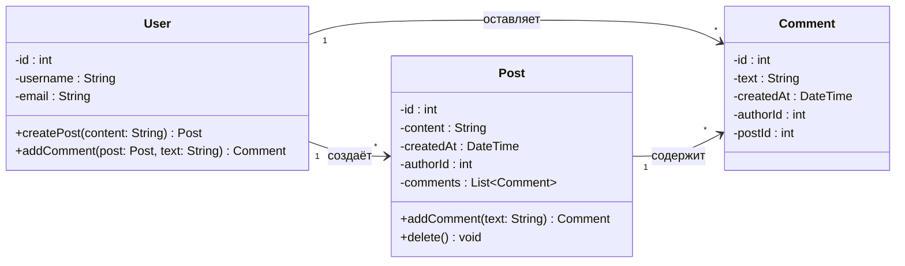

## Задание 6

### Обоснование
Я выбрала **агрегацию**, а не композицию (заполненный ромб). Хотя пост логически принадлежит пользователю, его жизненный цикл не всегда должен быть строго привязан к автору. Например, при удалении аккаунта (User) администратор может захотеть сохранить посты пользователя в системе (например, с пометкой «Аккаунт удалён»). Агрегация позволяет это смоделировать. Сильнее, чем ассоциация (просто стрелка), но мягче, чем композиция.