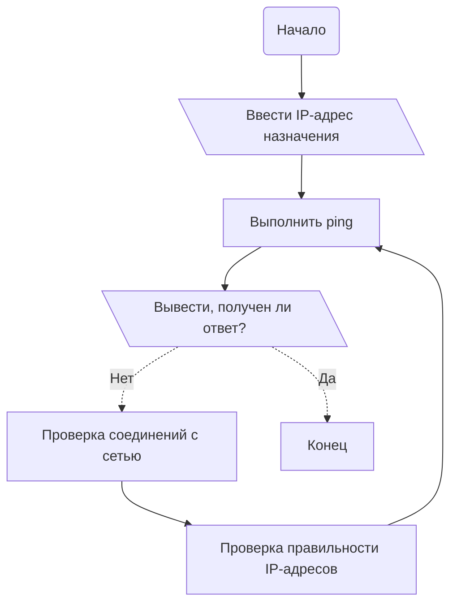
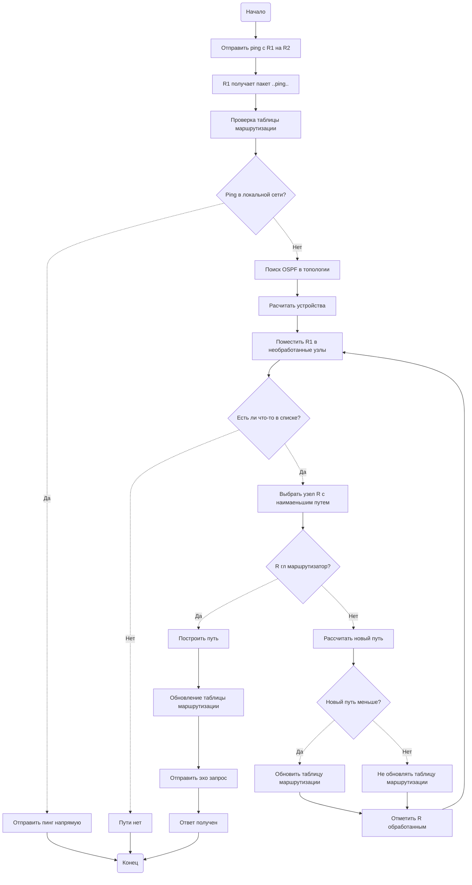
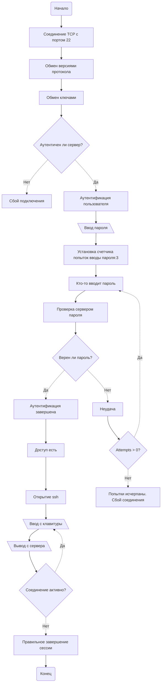
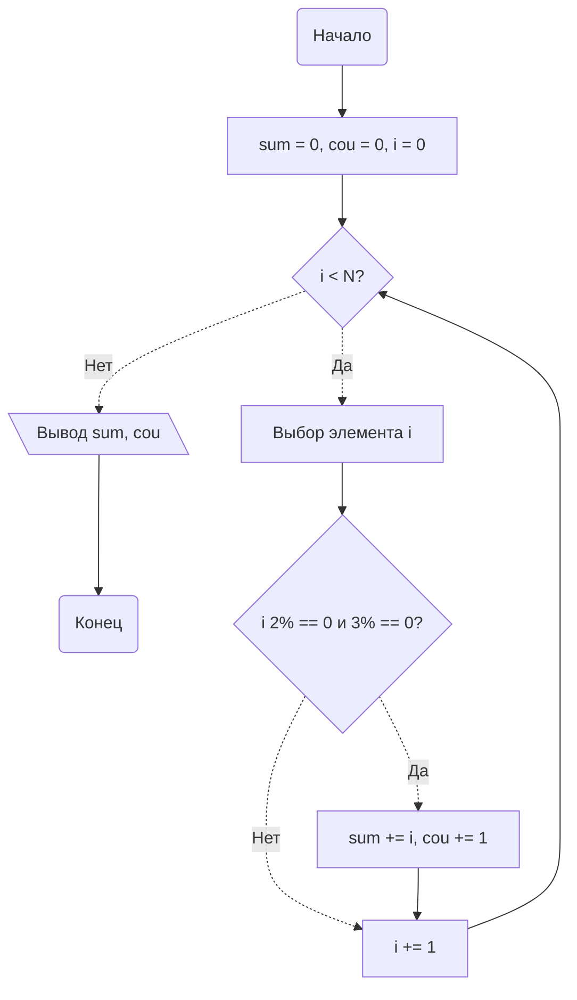

 ## Задание 1

```mermaid
flowchart TD
   id1(Начало)
   id2[\Ввести IP-адрес назначения\]
id1 --> id2 --> id3 --> id4 -. Нет .-> id5 --> id6 --> id3
id3[Выполнить ping]
id4[\Вывести, получен ли ответ?\]
id5[Проверка соединений c сетью]
id6[Проверка правильности IP-адресов]
id8[Конец]
id4 -.Да.-> id8
```

## Задание 2

```mermaid
flowchart TD

id1("Начало")

id2[Отправить ping с R1 на R2 ]

id1 --> id2

id3[R1 получает пакет ..ping..]

id2 --> id3 --> id4 --> id5 -.Да.-> id6 --> id7

id4[Проверка таблицы маршрутизации]

id5{Ping в локальной сети?}

id6[Отправить пинг напрямую]

id7("Конец")

id8[Поиск OSPF в топологии]

id5 -.Нет.-> id8 --> id9 --> id10 -->id11 -.Нет.-> id12

id9[Расчитать устройства]

id10[Поместить R1 в необработанные узлы]

id11{Есть ли что-то в списке? }

id12[Пути нет]

id12 --> id7

id13[Выбрать узел R с наимаеньшим путем]

id11-.Да.-> id13 --> id14 -.Да.-> id15

id14{R гл маршрутизатор?}

id15[Построить путь]

id16[Обновление таблицы маршрутизации]

id17[Отправить эхо запрос]

id18[Ответ получен]

id15 --> id16 --> id17 --> id18 --> id7

id19[Рассчитать новый путь]

id14-.Нет.-> id19 --> id20 -.Да.-> id21 --> id23

id20{Новый путь меньше?}

id21[Обновить таблицу маршрутизации]

id22[Не обновлять таблицу маршрутизации]

id20 -.Нет.-> id22 --> id23 --> id10

id23[Отметить R обработанным]
```

## Задание 3

```mermaid
flowchart TD

id1(Начало)

id2[Cоединение TCP с портом 22]

id3[Обмен версиями протокола]

id4[Обмен ключами]

id1 --> id2 --> id3 --> id4 --> id5

id5{Аутентичен ли сервер?}

id6[Сбой подключения]

id5 -.Нет.-> id6

id7[Аутентификация пользователя]

id5 -.Да.-> id7 --> id8 --> id9 --> id10 --> id11

id8[\Ввод пароля\]

id9[Установка счетчика попыток вводы пароля:3]

id10[Кто-то вводит пароль]

id11[Проверка сервером пароля]

id12{Верен ли пароль?}

id11 --> id12 -.Да.-> id13

id13[Аутентификация завершена]

id14[Неудача]

id12 -.Нет.-> id14

id15{Attempts > 0?}

id14 --> id15 -.Нет.-> id16

id16[Попытки исчерпаны. Сбой соединения]

id15 -.Да.-> id10

id17[Доступ есть]

id18[Открытие ssh]

id19[\Ввод с клавитуры\]

id13 --> id17 --> id18 --> id19 --> id20 --> id21 -.Нет.-> id22

id20[\Вывод с сервера\]

id21{Соединение активно?}

id22[Правильное завершение сессии]

id23(Конец)

id22 --> id23

id21 -.Да.-> id19
```

## Задание 4
Вариант 1

```mermaid
flowchart TD

id1(Начало)

id2[sum = 0, cou = 0, i = 0]

id1 --> id2 --> id3

id3{i < N?}

id4[Выбор элемента i]

id5[\Вывод sum, cou\]

id3 -.Да.-> id4

id3 -.Нет.-> id5 --> id6

id6(Конец)

id7{i 2% == 0 и 3% == 0?}

id8[i += 1]

id7 -.Нет.-> id8

id4 --> id7

id8 ---> id3

id9[sum += i, cou += 1]

id7 -.Да.-> id9 --> id8
```